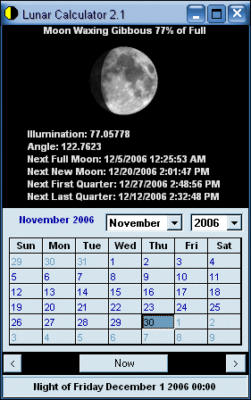



## Lunar Calculator 2\.1

### Description

This is a complete rework of chosen_reject's original submission at http://www.Planet-Source-Code.com/vb/scripts/ShowCode.asp?txtCodeId=58642&amp;lngWId=1

and implementation of D.W.'s MoonPhase.bas at

http://www.Planet-Source-Code.com/vb/scripts/ShowCode.asp?txtCodeId=29000&amp;lngWId=1

This program is capable of calculating moon phase and other information for any date thrown at it. The only possible limitations is the limits of Microsoft's calendar control. Their is plenty of room for more customizations. If you like it please don't forget to vote.
 
### More Info
 

             |
---                |---
**Submitted On**   |2006-11-05 02:16:02
**By**             |[Thomas Swift](https://github.com/Planet-Source-Code/PSCIndex/blob/master/ByAuthor/thomas-swift.md)
**Level**          |Intermediate
**User Rating**    |4.9 (34 globes from 7 users)
**Compatibility**  |VB 6\.0
**Category**       |[Complete Applications](https://github.com/Planet-Source-Code/PSCIndex/blob/master/ByCategory/complete-applications__1-27.md)
**World**          |[Visual Basic](https://github.com/Planet-Source-Code/PSCIndex/blob/master/ByWorld/visual-basic.md)
**Archive File**   |[Lunar\_Calc20377012142006\.zip](https://github.com/Planet-Source-Code/thomas-swift-lunar-calculator-2-1__1-66957/archive/master.zip)

